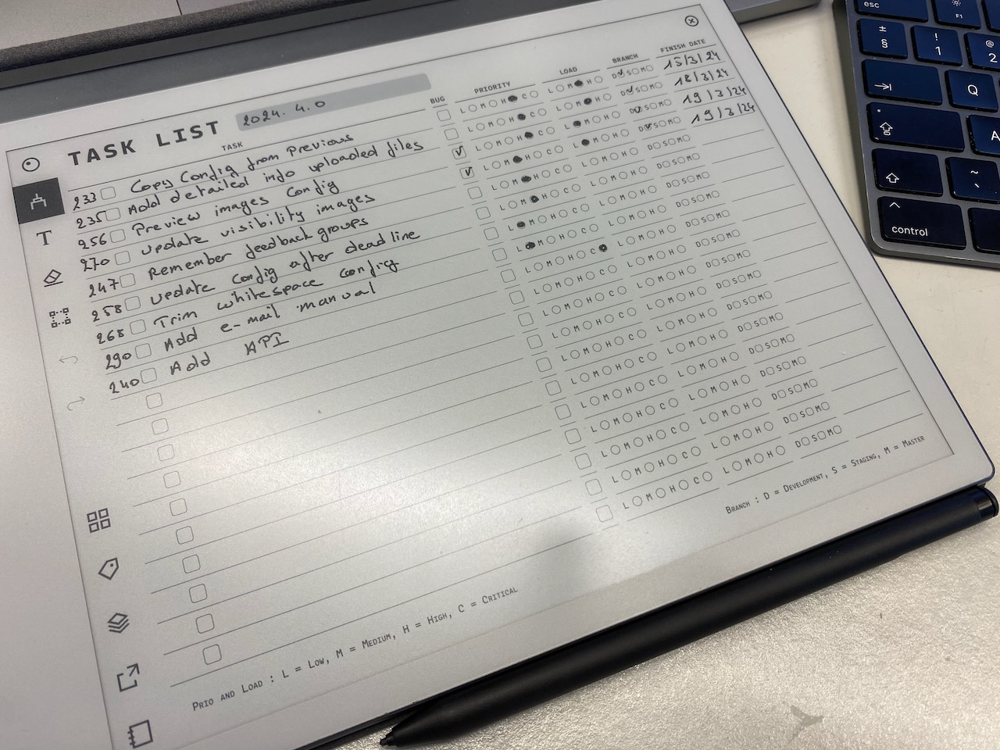

# Git Milestone Issue Tracker Template for reMarkable2

## Overview

The Git Milestone Issue Tracker Template for reMarkable2 is designed to enhance productivity and organization for developers working with Git issues. This documentation provides detailed instructions on how to effectively utilize the template to manage your software development workflow.

[Download](../templates/git_milestone_issue_tracker.png)

### Features

- **Issue Tracking**: Keep a concise record of your Git issue numbers alongside titles or brief descriptions.
- **Resolution Checkbox**: Easily mark issues as resolved with a checkbox.
- **Bug Identifier**: Identify and differentiate bugs from other issues with a dedicated checkbox.
- **Priority Selector**: Categorize issues by their priority levels: Low, Medium, High, or Critical.
- **Workload Assessment**: Estimate the workload required for each issue as Low, Medium, or High.
- **Code Branch**: Document the code branch where the solution was uploaded (Dev, Staging, Master).
- **Completion Date**: Note the date when the issue was resolved.

## Getting Started

### Setting Up Your Template

1. **Download the Template**: First, download the template file from the provided link.
2. **Transfer to Your reMarkable2**: Connect your reMarkable2 to your computer and transfer the template file to the device.
3. **Select the Template for New Notes**: In your reMarkable2, create a new notebook and select the GitLab Issue Tracker Template from the templates list.

### How to Use

1. **Create a New Entry**: For each Git issue, create a new entry in the template.
2. **Fill in the Details**:
   - Write down the Git issue number and a short title or description in the designated area.
   - Use the checkboxes to mark whether the issue is resolved and if it was a bug.
   - Select the priority of the issue and estimate the workload.
   - Specify the code branch used for the issue resolution.
   - Write down the completion date of the issue.
3. **Review and Update**: Regularly review your entries to update the status of issues, prioritize tasks, and plan your workload accordingly.

## Best Practices

- **Daily Updates**: Make it a habit to update the template with new issues and progress at the start or end of each day.
- **Weekly Reviews**: Conduct weekly reviews to assess progress, adjust priorities, and plan for the upcoming week.
- **Retrospectives**: Use completed entries for retrospective meetings to discuss what went well, what could be improved, and how to tackle future issues more efficiently.

## Conclusion

The Git Milestone Issue Tracker Template for reMarkable2 is a powerful tool for developers seeking to improve their workflow and productivity. By providing a structured way to track and manage Git issues, developers can focus more on coding and less on administrative tasks. Embrace this template to bring order and efficiency to your software development process.
